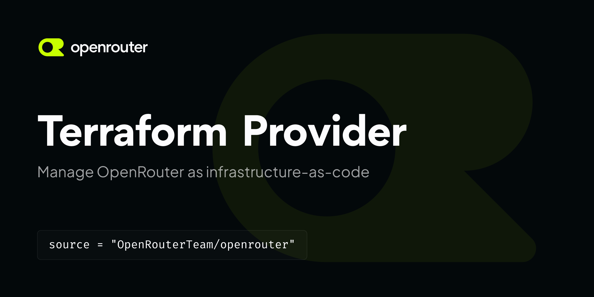

# OpenRouter Terraform Provider

The [OpenRouter Terraform Provider](https://registry.terraform.io/providers/OpenRouterTeam/openrouter/latest) lets you manage OpenRouter as infrastructure-as-code: API keys, guardrails, workspaces, BYOK provider credentials, and observability destinations — with full lifecycle support, drift detection, and import.

To learn more about the underlying platform, check out the [OpenRouter Documentation](https://openrouter.ai/docs). Reference docs for every resource and data source are on the [Terraform Registry](https://registry.terraform.io/providers/OpenRouterTeam/openrouter/latest/docs).

[](https://www.speakeasy.com/?utm_source=openrouter&utm_campaign=terraform)
[](https://opensource.org/licenses/MIT)

<!-- No Summary [summary] -->

<!-- No Table of Contents [toc] -->

<!-- Start Installation [installation] -->
## Installation

To install this provider, copy and paste this code into your Terraform configuration. Then, run `terraform init`.

```hcl
terraform {
  required_providers {
    openrouter = {
      source  = "OpenRouterTeam/openrouter"
      version = "0.2.90"
    }
  }
}

provider "openrouter" {
  server_url = "..." # Optional
}
```
<!-- End Installation [installation] -->

## Provider Usage

Authenticate with a [Management API key](https://openrouter.ai/settings/management-keys) (`sk-or-mgmt-...`) — management keys administer resources but cannot spend inference credits.

```hcl
provider "openrouter" {
  api_key = var.openrouter_management_key
}

resource "openrouter_workspace" "production" {
  name = "Production"
  slug = "production"
}

resource "openrouter_api_key" "backend" {
  name         = "backend-service"
  limit        = 100 # monthly credit limit in USD
  limit_reset  = "monthly"
  workspace_id = openrouter_workspace.production.id
}

resource "openrouter_guardrail" "cost_cap" {
  name           = "cost-cap"
  limit_usd      = 50
  reset_interval = "monthly"
  enforce_zdr    = true
}
```

<!-- Start Authentication [security] -->
## Authentication

This provider supports authentication configuration via environment variables and provider configuration.

The configuration precedence is:

- Provider configuration
- Environment variables

Available configuration:

| Provider Attribute | Description |
|---|---|
| `api_key` | API key as bearer token in Authorization header. Configurable via environment variable `OPENROUTER_MANAGEMENT_KEY`. |
<!-- End Authentication [security] -->

<!-- Start Available Resources and Data Sources [operations] -->
## Available Resources and Data Sources

### Managed Resources

* [openrouter_api_key](docs/resources/api_key.md)
* [openrouter_byok_key](docs/resources/byok_key.md)
* [openrouter_guardrail](docs/resources/guardrail.md)
* [openrouter_observability_destination](docs/resources/observability_destination.md)
* [openrouter_scim_group_mapping](docs/resources/scim_group_mapping.md)
* [openrouter_workspace](docs/resources/workspace.md)
* [openrouter_workspace_budget](docs/resources/workspace_budget.md)

### Data Sources

* [openrouter_api_key](docs/data-sources/api_key.md)
* [openrouter_api_keys](docs/data-sources/api_keys.md)
* [openrouter_byok_key](docs/data-sources/byok_key.md)
* [openrouter_byok_keys](docs/data-sources/byok_keys.md)
* [openrouter_credits](docs/data-sources/credits.md)
* [openrouter_guardrail](docs/data-sources/guardrail.md)
* [openrouter_guardrail_key_assignments](docs/data-sources/guardrail_key_assignments.md)
* [openrouter_guardrail_member_assignments](docs/data-sources/guardrail_member_assignments.md)
* [openrouter_guardrails](docs/data-sources/guardrails.md)
* [openrouter_model](docs/data-sources/model.md)
* [openrouter_models](docs/data-sources/models.md)
* [openrouter_observability_destination](docs/data-sources/observability_destination.md)
* [openrouter_observability_destinations](docs/data-sources/observability_destinations.md)
* [openrouter_organization_members](docs/data-sources/organization_members.md)
* [openrouter_preset](docs/data-sources/preset.md)
* [openrouter_presets](docs/data-sources/presets.md)
* [openrouter_providers](docs/data-sources/providers.md)
* [openrouter_scim_group_mapping](docs/data-sources/scim_group_mapping.md)
* [openrouter_workspace](docs/data-sources/workspace.md)
* [openrouter_workspace_budget](docs/data-sources/workspace_budget.md)
* [openrouter_workspace_budgets](docs/data-sources/workspace_budgets.md)
* [openrouter_workspace_members](docs/data-sources/workspace_members.md)
* [openrouter_workspaces](docs/data-sources/workspaces.md)
<!-- End Available Resources and Data Sources [operations] -->

<!-- Start Testing the provider locally [usage] -->
## Testing the provider locally

#### Local Provider

Should you want to validate a change locally, the `--debug` flag allows you to execute the provider against a terraform instance locally.

This also allows for debuggers (e.g. delve) to be attached to the provider.

```sh
go run main.go --debug
# Copy the TF_REATTACH_PROVIDERS env var
# In a new terminal
cd examples/your-example
TF_REATTACH_PROVIDERS=... terraform init
TF_REATTACH_PROVIDERS=... terraform apply
```

#### Compiled Provider

Terraform allows you to use local provider builds by setting a `dev_overrides` block in a configuration file called `.terraformrc`. This block overrides all other configured installation methods.

1. Execute `go build` to construct a binary called `terraform-provider-openrouter`
2. Ensure that the `.terraformrc` file is configured with a `dev_overrides` section such that your local copy of terraform can see the provider binary

Terraform searches for the `.terraformrc` file in your home directory and applies any configuration settings you set.

```
provider_installation {

  dev_overrides {
      "registry.terraform.io/OpenRouterTeam/openrouter" = "<PATH>"
  }

  # For all other providers, install them directly from their origin provider
  # registries as normal. If you omit this, Terraform will _only_ use
  # the dev_overrides block, and so no other providers will be available.
  direct {}
}
```
<!-- End Testing the provider locally [usage] -->

<!-- Placeholder for Future Speakeasy SDK Sections -->

# Development

## Contributions

While we value open-source contributions to this terraform provider, this library is generated programmatically. Any manual changes added to internal files will be overwritten on the next generation.
We look forward to hearing your feedback. Feel free to open a PR or an issue with a proof of concept and we'll do our best to include it in a future release. 

### SDK Created by [Speakeasy](https://www.speakeasy.com/?utm_source=openrouter&utm_campaign=terraform)
